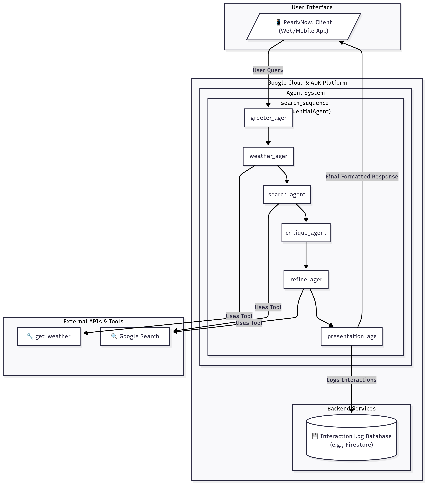

# Challenge Six: FEMA Case Study
**Context**: You've been hired by FEMA to build an Emergency Preparedness Chat (ReadyNow!).

## Stakeholder Reqs
* Real-time weather and news alerts
* In event of disaster, provide suggested routes to safety
* Log all interactions between user and agent
* Validate user input as appropriate and refuse requests if they don't relate to agent's mission
* Ensure agent responses are valid, well written, and easy to understand

## Instructions
1. Create an architecture diagram that depicts your solution to ReadyNow!
2. Implement the case study requirements using a Colab Enterprise Jupyter Notebook.
3. Program your solution any way you like. Use the code you created from the earlier
challenges as a guide. Also, feel free to ask Gemini for help.
4. Test your agent locally .
5. Deploy your agent to Agent Engine.
6. Write test code to demonstrate a working, deployed solution.
7. Upload all artifacts to your GitHub repository for grading.

## Architecture Diagram
